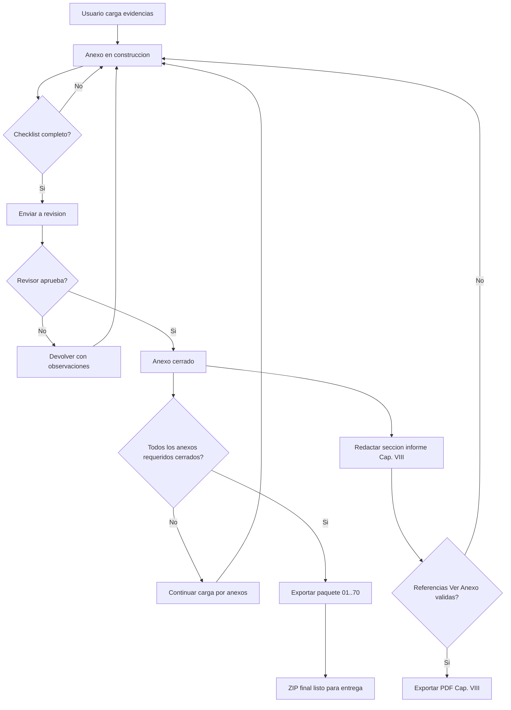
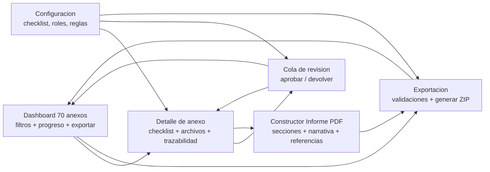

# Análisis de solución — Recolector de Anexos Preconteo (RNEC / UT ILE 2026)

Documento generado a partir del análisis de los materiales de referencia (Capítulo VIII – Preconteo y Comunicaciones, relación de anexos en Excel, estructura de carpetas «Anexos Preconteo Congreso»).

### Convención de lectura (presentación vs. profundidad)


| Tipo de contenido                                                 | Dónde está                                                 | Uso sugerido                                                                                                                 |
| ----------------------------------------------------------------- | ---------------------------------------------------------- | ---------------------------------------------------------------------------------------------------------------------------- |
| **Sustentado en informe Cap. VIII + Excel + listado de carpetas** | §1 (parte factual), nota bajo §2, §4 (preguntas de cierre) | Presentación ejecutiva: citar solo esto como «lo que dicen los documentos».                                                  |
| **Propuesta de producto / arquitectura / roadmap**                | §2 (tabla RFC), §§3–6                                      | «Cómo podríamos implementarlo»; **no** son obligaciones extraídas del informe Cap. VIII salvo donde se indique lo contrario. |


---

## 1. Qué es realmente el «formulario»

El «formulario» no es un formulario web tradicional de un solo paso. Es un **expediente estructurado de 70 anexos** que la UT ILE 2026 debe entregar a la Registraduría Nacional del Estado Civil (RNEC) como evidencia de ejecución del **Capítulo VIII – Preconteo y Comunicaciones** del Contrato 049/2025 (elecciones Congreso 2026).

Cada anexo es una **carpeta con un tipo de evidencia muy específico** que debe alimentarse a lo largo del cronograma del proyecto (no de una sola vez).

### Taxonomía real de los 70 anexos

Tras cruzar la sección **11. Entregables** del PDF de Comunicaciones (págs. 141–143) con los nombres de carpeta, los 70 anexos se reducen a **6 familias** de artefactos (agrupación lógica para el diseño; el listado oficial sigue siendo el Excel + la tabla del informe):


| Familia                                                                                   | # anexos | Ejemplos                                                                                       | Naturaleza del archivo                                                                                                                                                                            |
| ----------------------------------------------------------------------------------------- | -------- | ---------------------------------------------------------------------------------------------- | ------------------------------------------------------------------------------------------------------------------------------------------------------------------------------------------------- |
| **A. Actas** (suscritas con la supervisión del contrato y la UT ILE 2026 — informe §11.b) | ~28      | 01, 02, 03, 18, 26, 27, 29, 31, 32, 33, 37, 41, 42, 44, 46, 50, 52, 53, 56, 59, 61, 64, 65, 66 | Documento de acta acordado entre partes. El informe **no** especifica si la firma es manuscrita escaneada, electrónica simple o certificada; eso depende del **contrato / oficios** (ver **Q3**). |
| **B. Entregables técnicos de prueba** (MMV, boletines, FRT, logs, estados)                | ~14      | 28, 30, 34, 38, 40, 43, 45, 47, 51, 54, 57, 60, 67                                             | Sets heterogéneos: archivos `.MMV`, PDFs de boletines, imágenes JPG/PNG de FRT, logs `.txt/.csv`, capturas de comunicaciones                                                                      |
| **C. Planos y certificaciones físicas/eléctricas/datos**                                  | ~9       | 08, 09, 10, 11, 12, 13, 14, 15, 19, 22                                                         | PDF/DWG + certificados firmados por ingeniero responsable                                                                                                                                         |
| **D. Capacitación** (planes + evidencias)                                                 | 5        | 05, 06, 07, 23, 24, 25                                                                         | Cronogramas, listas de asistencia, fotos, kits                                                                                                                                                    |
| **E. Personal y comunicaciones** (recurso humano)                                         | 6        | 35, 36, 48, 49, 62, 63                                                                         | Matrices Excel/CSV de personal por rol/sede + mallas de contacto                                                                                                                                  |
| **F. Documentación de software/HW + seguridad**                                           | 8        | 04, 16, 17, 20, 21, 58, 68, 69, 70                                                             | Manuales, registros de derechos de autor, licencias, protocolos, evidencias de monitoreo y ciberseguridad                                                                                         |


> **Clave:** no se diseña un único formulario, sino un sistema con **6 sub-flujos de captura** y un metamodelo común (cada artefacto tiene anexo destino, tipo, autor, fecha de evento, firmantes esperados, estado).

### Origen de la información (quién la genera)

- **34 CRT + 6 OSD + 33 Salas de Prensa** generan evidencia en paralelo (planos, certificaciones, actas locales).
- **Casa Matriz / Data Center** genera evidencia central (pruebas técnicas, monitoreo BD, ciberseguridad).
- **Coordinador de capacitación** alimenta familias D y E.
- **Líder técnico / Gerencia de Informática** en actas centrales (registro SW, custodia código fuente, exposición código).
- **Brigada de emergencias** genera anexo 25.

La solución **propuesta** debe permitir **múltiples roles** que cargan diferentes tipos de evidencia, con **flujo de aprobación** antes de quedar como «oficial» en la carpeta destino (diseño de producto; no texto literal del informe Cap. VIII).

> **Ver también:** § 1.5 más abajo (*Estructura de carpetas: hipótesis y qué falta confirmar*).

---

## 1.5 Estructura de carpetas: cómo lo interpretamos (hipótesis) y qué falta confirmar

### Cómo creemos que es (hipótesis del equipo)

- Las carpetas numeradas (`01. …` a `70. …`) bajo **«Anexos Preconteo Congreso»** son la **plantilla de expediente** alineada al listado contractual (Excel `Cap_VIII` y sección 11 del PDF de Comunicaciones).
- **Destino del paquete:** es donde debe **terminar** la evidencia que se entrega a supervisión / RNEC: actas, entregables técnicos, planos, etc., con la numeración y nombres acordados.
- **Uso a lo largo del proyecto:** pueden existir **vacías al inicio** y ir llenándose por hitos (simulacros, pruebas, día electoral); la misma estructura puede servir como **repositorio vivo** hasta el cierre del anexo.
- **Relación con un «formulario» digital:** el informe describe **entrega de documentos y actas**; si se construye software, lo habitual es que **pantallas o APIs** carguen metadata y archivos y el sistema **exporte** a esta jerarquía; las carpetas serían **salida** del proceso de recolección (hipótesis de implementación).

### Nota para el lector (interrogante explícito)

Lo anterior se infiere de los documentos y de haber visto carpetas vacías en disco; **no sustituye una confirmación formal** de UT ILE / supervisión del contrato. En particular no está cerrado si existe **otro canal oficial** (intranet, oficio, herramienta RNEC) que deba recibir los mismos archivos además del paquete en carpetas, ni si la nomenclatura **dentro** de cada carpeta está reglamentada más allá del listado de anexos.

**Pregunta a cerrar con quien corresponda:** ¿las carpetas son solo plantilla inicial, el depósito final obligatorio, o también entrada a otro sistema/formulario institucional?

---

## 2. Requisitos derivados (RFC 2119) — *propuesta de producto*

> **Nota:** Los IDs R1–R19 describen un **software de apoyo** deseable para la operación; **solo** donde el texto remite a ley general (p. ej. tratamiento de datos personales) aplica independientemente del informe. **R9** fue recalibrado: el informe Cap. VIII **no** pide Ley 527 ni firma electrónica en el apartado de actas analizado.


| ID  | Tipo   | Requisito                                                                                                                                                                                                                                                                                                                                                                                            |
| --- | ------ | ---------------------------------------------------------------------------------------------------------------------------------------------------------------------------------------------------------------------------------------------------------------------------------------------------------------------------------------------------------------------------------------------------- |
| R1  | MUST   | Modelar los 70 anexos con su tipo de evidencia esperada, formato(s) válido(s) y responsables/firmantes **según tabla del informe y acuerdos operativos** (no inventar exigencias de firma no citadas).                                                                                                                                                                                               |
| R2  | MUST   | Soportar carga multi-archivo por anexo, con metadata mínima (fecha de evento, sede CRT/OSD, autor, descripción).                                                                                                                                                                                                                                                                                     |
| R3  | MUST   | Validar completitud por anexo según una lista de chequeo (p. ej. anexo 28 = MMV + boletines + FRT + logs, según §11.a del informe).                                                                                                                                                                                                                                                                  |
| R4  | MUST   | Generar la **estructura de carpetas final** idéntica a la plantilla (numeración + nombres exactos del Excel / informe), lista para entrega contractual.                                                                                                                                                                                                                                              |
| R5  | MUST   | Trazabilidad: quién subió qué, cuándo, qué versión, qué aprobación, hash del archivo.                                                                                                                                                                                                                                                                                                                |
| R6  | SHOULD | Workflow de revisión: estados `borrador → en revisión → aprobado → entregado a RNEC`.                                                                                                                                                                                                                                                                                                                |
| R7  | SHOULD | Vincular anexos relacionados (28 referencia 27, 30 referencia 29, etc.) y bloquear cierre si falta el par.                                                                                                                                                                                                                                                                                           |
| R8  | SHOULD | Soporte off-line / sincronización para CRT en zonas con conectividad limitada (Amazonas, Vichada, etc.).                                                                                                                                                                                                                                                                                             |
| R9  | SHOULD | **Solo si el contrato u oficio lo define:** integrar medio de firma acordado para actas (p. ej. electrónica simple Ley 527/1999 o firma certificada). *El informe Cap. VIII §11.b solo exige actas «suscritas» entre supervisión y UT, sin detallar el medio.* Si no hay mandato contractual, bastan PDF firmados **por el proceso acordado** (incl. manuscrito escaneado) más registro en bitácora. |
| R10 | MUST   | Si el sistema almacena datos personales (anexos 35, 48, 63), cumplir **Ley 1581/2012** y **Ley 1712/2014** y políticas RNEC que apliquen (marco legal general, no párrafo específico del informe Cap. VIII revisado).                                                                                                                                                                                |
| R11 | SHOULD | Auditoría inmutable (append-only log) — coherente con que el proceso electoral es auditado (informe §10, resolución CNE 09458/2025 citada allí); el **formato técnico** del log del *recolector* es decisión de producto.                                                                                                                                                                            |
| R12 | MAY    | Plantillas pre-llenadas de actas que se generen desde el sistema (reduce errores manuales).                                                                                                                                                                                                                                                                                                          |
| R13 | MAY    | Dashboard de avance: % de anexos cerrados, próximos vencimientos por simulacro/evento.                                                                                                                                                                                                                                                                                                               |
| R14 | MUST   | Exportación a ZIP final con la estructura de 70 carpetas para entrega contractual.                                                                                                                                                                                                                                                                                                                   |
| R15 | MUST   | Gestionar la **construcción del informe PDF Cap. VIII** como salida del proceso: estado por capítulo/sección, redacción controlada y trazabilidad de cambios.                                                                                                                                                                                                                                      |
| R16 | MUST   | Permitir bloques narrativos por sección (p. ej. “6. CAPACITACIÓN”), con texto editable, historial de versiones y responsable de edición.                                                                                                                                                                                                                                                            |
| R17 | MUST   | Vincular evidencia desde el texto narrativo usando referencias tipo **“Ver Anexo XX”** que apunten a anexos/archivos existentes del expediente 01–70.                                                                                                                                                                                                                                             |
| R18 | SHOULD | Validar consistencia antes de exportar PDF (si se cita “Anexo 23”, debe existir evidencia cargada; alertar citas huérfanas o anexos vacíos).                                                                                                                                                                                                                                                       |
| R19 | SHOULD | Generar exportación PDF con plantilla institucional (encabezado, pie de página, numeración, portada e índice).                                                                                                                                                                                                                                                                                     |


### Nota aparte — PDF GIFT06 («firma digitalizada»)

En el PDF *23. ALCANCE ANEXO 1 COMPONENTE TÉCNICO* aparece **«firma digitalizada»** de comisión escrutadora en requisitos de **software de escrutinio** (aprox. págs. 510 y 546). Ese contexto es **distinto** del paquete de anexos de preconteo del informe Cap. VIII; **no** sustenta por sí solo R9 para los 70 anexos sin revisar el contrato completo.

---

## 3. Decisiones de arquitectura (con trade-offs)

### 3.1 Despliegue y privacidad


| Opción                                                         | Pros                                                                 | Contras                            | Idoneidad           |
| -------------------------------------------------------------- | -------------------------------------------------------------------- | ---------------------------------- | ------------------- |
| **A. Web app on-premise** (servidor UT ILE)                    | Control total; alineado con restricciones de datos sensibles         | Requiere infra propia, backups, HA | ★★★★                |
| **B. SaaS multi-tenant** (Vercel/Render + Postgres gestionado) | Time-to-market rápido                                                | Menos control ante auditoría RNEC  | ★★                  |
| **C. Nube privada** (AWS/Azure región CO)                      | Cumplimiento + escalabilidad; CDN, WAF, IDS coherentes con el pliego | Costo + complejidad                | ★★★★★ (recomendada) |
| **D. App de escritorio + sync**                                | Funciona off-line en CRT remotos                                     | Distribución, actualizaciones      | ★★                  |


**Recomendación:** **C** con un **PWA** que permita carga offline en CRT con conectividad intermitente y sincronización al volver en línea (R8 sin sacrificar trazabilidad central).

### 3.2 Stack tecnológico


| Stack                                             | Pros                                                | Contras                                     |
| ------------------------------------------------- | --------------------------------------------------- | ------------------------------------------- |
| **NestJS + PostgreSQL + S3-compatible + Next.js** | Tipado fuerte; auth/audit maduro; uploads complejos | Curva si el equipo es otro stack            |
| **Django + PostgreSQL + S3**                      | Admin generado para sub-flujos                      | Frontend menos rico para uploads masivos    |
| **Spring Boot + React**                           | Familiar en sector público CO                       | Más boilerplate                             |
| **Laravel + Filament + MySQL**                    | Velocidad de admin                                  | Menos maduro para audit trail criptográfico |


**Recomendación:** **NestJS + Next.js + PostgreSQL + MinIO/S3** (separación API auditable / frontend optimizado; JSONB para metadata por familia; almacenamiento on-prem posible con MinIO).

### 3.3 Modelo de datos (núcleo)

```text
Anexo (catalog, 70 rows seeded)
  id, numero, nombre, familia (A–F), descripcion,
  evidencias_requeridas: jsonb [{tipo, min, max, formatos[]}],
  firmantes_requeridos: jsonb [{rol, obligatorio}],  // según informe + operación
  anexos_relacionados: int[]

Sede
  id, tipo (CRT|OSD|SalaPrensa|CasaMatriz|DataCenter|CentroControl),
  departamento, ciudad, direccion

Evento (simulacro I, simulacro II, día electoral, prueba 10%, etc.)
  id, codigo, nombre, fecha_evento

Entrega (instancia: un anexo en una sede para un evento)
  id, anexo_id, sede_id, evento_id (nullable),
  estado (borrador|en_revision|aprobado|entregado),
  responsable_id, fechas (creado, ultima_revision, aprobado)

Archivo
  id, entrega_id, ruta_storage, nombre_original, hash_sha256,
  tipo_evidencia, tamaño, mime, subido_por_id, subido_en

Firma / constancia de acta
  id, entrega_id, firmante_id, rol,
  metodo (según Q3: manual_escaneada | electronica_simple | certificada | otro),
  fecha, hash_documento_firmado

AuditLog (append-only)
  id, actor_id, accion, entidad, entidad_id, payload jsonb, ts, ip, user_agent

InformeCapitulo (salida PDF narrativa)
  id, nombre, version, estado_borrador, fecha_corte, generado_por

SeccionInforme
  id, informe_id, codigo (ej: "6"), titulo ("CAPACITACIÓN"), orden,
  estado (pendiente|en_redaccion|revision|aprobada)

BloqueNarrativo
  id, seccion_id, tipo (parrafo|lista|tabla|imagen),
  contenido, autor_id, version, updated_at

ReferenciaAnexo
  id, bloque_id, anexo_numero, entrega_id (nullable),
  texto_visible ("Ver Anexo 23"), validada (bool), observacion_validacion
```

### 3.4 Generación del paquete final

Un job `export_paquete(evento_id, sede_id?)` recorre las entregas aprobadas y construye el ZIP:

```text
Anexos Preconteo Congreso/
  01. Acta de aprobación CRT - OSD/
  02. Acta de verificación de implementación CRT - OSD/
  ...
  70. Licenciamiento de la BD transaccional y componentes del HW/
```

Incluir `manifest.json` con hashes y, si aplica, PDF de portada con índice firmado por el supervisor (**según proceso acordado**, ver Q3).

---

## 4. Riesgos y vacíos abiertos


| #   | Riesgo / pregunta                                                                                                                                                                                                                                                                                                 | Por qué importa                                                                                              |
| --- | ----------------------------------------------------------------------------------------------------------------------------------------------------------------------------------------------------------------------------------------------------------------------------------------------------------------- | ------------------------------------------------------------------------------------------------------------ |
| Q1  | ¿La RNEC o supervisión imponen nomenclatura de archivos **dentro** de cada carpeta?                                                                                                                                                                                                                               | Si existe (p. ej. oficio ILE26-001 u otro), el modelo debe respetarlo.                                       |
| Q2  | ¿Usuarios concurrentes esperados? (CRT × roles × eventos)                                                                                                                                                                                                                                                         | Dimensionamiento y pruebas de carga.                                                                         |
| Q3  | ¿El **contrato** o anexos definen el **medio de firma** de las actas del §11.b (manuscrita escaneada, electrónica simple, certificada)?                                                                                                                                                                           | Sin esto, R9 no puede fijar proveedor ni Ley 527 como obligación del proyecto recolector.                    |
| Q4  | ¿Existe ya un sistema legacy de UT ILE que recolecta esto?                                                                                                                                                                                                                                                        | Migración vs greenfield y conectores.                                                                        |
| Q5  | ¿Calendario de simulacros y hitos?                                                                                                                                                                                                                                                                                | Driver del módulo de eventos y notificaciones.                                                               |
| Q6  | ¿Solo español en UI?                                                                                                                                                                                                                                                                                              | Asumido por defecto.                                                                                         |
| Q7  | ¿Preferencia de stack del equipo UT ILE?                                                                                                                                                                                                                                                                          | Ajuste respecto a NestJS recomendado.                                                                        |
| Q8  | ¿Auditoría externa exige ver el código del recolector?                                                                                                                                                                                                                                                            | Depende de alcance contractual del software; preparar si aplica.                                             |
| Q9  | **¿Rol exacto de la carpeta «Anexos Preconteo Congreso»?** ¿Solo plantilla vacía al inicio, **obligatorio** como estructura final de entrega, o también **entrada** que alimenta otro formulario/sistema oficial de RNEC o supervisión? ¿Hay reglas adicionales de nombres de archivo **dentro** de cada carpeta? | Sin confirmación, el diseño del export (R4/R14) y la UX pueden desalinearse del proceso real. Ver **§ 1.5**. |


---

## 5. Hoja de ruta sugerida (3 fases)

**Fase 0 — Decisiones.** Resolver Q1, Q3, Q5, Q7, **Q9** (rol de las carpetas, medio de firma, canales de entrega). Confirmar despliegue (§3.1) y stack (§3.2).

**Fase 1 — MVP del recolector (4–6 semanas).** Catálogo de 70 anexos seedeado, autenticación con roles, carga + metadata + hash, export ZIP idéntico al árbol de carpetas, audit log básico. Actas: **PDF u orden de carga acordado con Q3** (si aún no hay firma electrónica obligatoria, flujo manual escaneado + trazabilidad). Incluir base del **constructor del informe Cap. VIII** (secciones + redacción + referencias “Ver Anexo XX”).

**Fase 2 — Workflow + firma según contrato (3–4 semanas).** Estados de aprobación, validaciones de completitud por anexo, **integración de firma solo si Q3 lo exige** (electrónica simple / certificada); si no, reforzar flujo de revisión y sellado de versión. Dashboard de avance, notificaciones por evento. Añadir validación de referencias narrativas (texto ↔ anexo) y export PDF con plantilla.

**Fase 3 — Endurecimiento auditoría (2–3 semanas).** Logs WORM o política de retención acordada, exportable para revisión, pruebas de carga, hardening alineado con lineamientos de seguridad que apliquen al componente contratado.

---

## 6. Próximos pasos sugeridos

1. Resolver las preguntas abiertas (sección 4), incluida **Q3** (medio de firma) y **Q9** (carpetas), con el equipo de UT ILE y/o supervisión del contrato.
2. Ejecutar exploración SDD del catálogo de anexos (`/sdd-explore catálogo-de-anexos`) cuando corresponda.
3. Crear change formal (`/sdd-new mvp-recolector-anexos-preconteo`) con specs, diseño y tareas.

---

## 6.1 Guía documental rápida — Campos y propósito

> Esta guía aclara la diferencia entre “descripción del anexo”, “descripción de evidencia” y “texto del informe PDF”.

| Nivel | Campo | Alcance | ¿Cambia con el tiempo? | Ejemplo | Para qué sirve |
|-------|-------|---------|------------------------|---------|----------------|
| 1 | **Descripción del anexo (catálogo)** | General del anexo (`01..70`) | Poco (solo si ajustan lineamientos) | Anexo 23: “Evidencias de capacitaciones a funcionarios” | Orientar a los usuarios sobre qué tipo de soportes deben ir en esa carpeta/anexo. |
| 2 | **Descripción de la evidencia/entrega** | Específico por archivo o lote cargado | Sí, en cada carga | “Lista de asistencia jornada Bogotá 2026-02-10” | Dar contexto operativo al archivo: qué es, cuándo se generó, de qué sede/evento viene. |
| 3 | **Texto narrativo del Informe Cap. VIII** | Sección del PDF final (p. ej. “6. CAPACITACIÓN”) | Sí, por iteración del informe | “La UT ILE 2026 garantizó… Ver Anexo 23…” | Construir el relato formal del informe y relacionar evidencias mediante referencias “Ver Anexo XX”. |

### Regla práctica para evitar confusión

- Si el texto explica **qué contiene una carpeta/anexo en general** → va en **Descripción del anexo**.
- Si el texto explica **qué contiene ese archivo puntual** → va en **Descripción de evidencia**.
- Si el texto redacta **el informe que se entrega como PDF** → va en **Texto narrativo**.

### Mini flujo documental recomendado

1. Definir/validar el catálogo de anexos (nivel 1).
2. Cargar evidencias con su contexto (nivel 2).
3. Redactar secciones del informe con referencias a anexos (nivel 3).
4. Validar que cada “Ver Anexo XX” tenga evidencia cargada antes de exportar PDF.

---

## Referencias de materiales analizados

- Informe Capítulo VIII – Preconteo y Comunicaciones (PDF «Congreso Inf. Cap. VIII - Preconteo - Comunicaciones»): §10 auditorías, §11 entregables y actas a suscribir.
- Alcance Anexo 1 Componente Técnico (PDF maestro GIFT06): referencia puntual «firma digitalizada» en contexto de **escrutinio** (págs. ~510, ~546), no como sustento directo del recolector de anexos de preconteo.
- Excel «Relación Anexos Preconteo Congreso» (hoja `Cap_VIII`: índice 1–70 con nombre de carpeta).
- Estructura de carpetas `Anexos Preconteo Congreso/01. …` hasta `70. …`.

---

## Mock funcional (MVP) en Markdown

> Objetivo: visualizar cómo sería el software **sin asumir requisitos no confirmados** (firma/canal oficial).

### Roles de aplicación (cargador / revisor / admin)

| Rol | Responsabilidad principal | En el mock HTML (`mock-html/index.html`) |
| --- | --- | --- |
| **Cargador** | Construye cada anexo: checklist, sube evidencias (nivel 2), solicita ajustes de ficha vía admin si aplica, **envía el anexo a revisión** cuando corresponde. | Flujo **Abrir** desde **1) Dashboard** o **2) Anexos** → vista detalle (sin pestaña propia). |
| **Revisor** | Atiende la **cola de revisión**: abre el anexo, verifica ficha + archivos + trazabilidad, **aprueba** o **devuelve** con observaciones. No sustituye al admin en cambios de catálogo. | Pestaña **6) Revisión** (estilo visual distinto en la barra superior para marcar otro rol). |
| **Admin** | Catálogo de 70 anexos, reglas de exportación, estados de flujo, roles, checklists por anexo. | **7) Configuración** (tabla de parámetros y reglas documentales). |

**Nota:** En el prototipo estático no hay login: cualquier lector puede entrar a todas las pestañas; en producto se restringiría **6) Revisión** (y acciones de aprobación) a perfiles **revisor** / **admin**.

### Módulo 1 — Dashboard de 70 anexos

```text
+--------------------------------------------------------------------------------------+
| Recolector de Anexos Preconteo                           Evento: [Simulacro I   v]  |
+--------------------------------------------------------------------------------------+
| Filtros: [Estado v] [Sede v] [Familia v] [Buscar anexo.........................]    |
+--------------------------------------------------------------------------------------+
| #  | Nombre Anexo                                            | Estado     | Evidencias|
| 01 | Acta de aprobación CRT - OSD                            | Cerrado    | 3         |
| 02 | Acta de verificación de implementación CRT - OSD        | Revisión   | 2         |
| 03 | Acta de verificación de implementación Sala de Prensa   | Pendiente  | 0         |
| .. | ...                                                     | ...        | ...       |
| 70 | Licenciamiento de la BD transaccional y componentes HW  | Construcción| 1        |
+--------------------------------------------------------------------------------------+
| Progreso global: 32/70 cerrados (45.7%)         [Exportar paquete 01..70]           |
+--------------------------------------------------------------------------------------+
```

### Módulo 2 — Detalle de anexo (carga y control)

```text
+--------------------------------------------------------------------------------------+
| Anexo 28 — Entregables prueba Casa Matriz                                           |
| Estado: En construcción      Sede: Casa Matriz      Evento: Prueba Casa Matriz      |
+--------------------------------------------------------------------------------------+
| Checklist operativo (editable por configuración):                                    |
| [x] MMV        [x] Boletines        [ ] Imágenes FRT        [x] Logs comunicaciones |
+--------------------------------------------------------------------------------------+
| Archivos cargados                                                                     |
| - boletin_preconteo_v3.pdf      (subido por: jrocha / 2026-02-11 14:22)             |
| - consolidado_mmv_01.mmv        (subido por: acastro / 2026-02-11 14:31)            |
| - log_telefonia_crt.zip         (subido por: acastro / 2026-02-11 14:45)            |
| [Subir archivos] [Agregar nota] [Marcar listo para revisión]                         |
+--------------------------------------------------------------------------------------+
| Trazabilidad                                                                          |
| 14:22 carga archivo | 14:31 reemplazo versión | 14:45 carga evidencia                |
+--------------------------------------------------------------------------------------+
```

### Módulo 3 — Revisión y cierre (rol **revisor**; en el mock HTML es la pestaña **6) Revisión**)

```text
+--------------------------------------------------------------------------------------+
| Cola de revisión                                                                      |
+--------------------------------------------------------------------------------------+
| Anexo | Sede        | Evento         | Solicitó       | Fecha              | Acción  |
| 02    | CRT Antioquia| Simulacro I   | coord.crt      | 2026-02-12 09:10   | Revisar |
| 28    | Casa Matriz | Prueba matriz  | lider.pruebas  | 2026-02-12 09:44   | Revisar |
+--------------------------------------------------------------------------------------+
| [Aprobar anexo] [Devolver con observaciones]                                          |
+--------------------------------------------------------------------------------------+
```

### Módulo 4 — Exportación contractual

```text
+--------------------------------------------------------------------------------------+
| Exportar paquete de entrega                                                           |
+--------------------------------------------------------------------------------------+
| Alcance: [Todo el proyecto v]   o   [Evento específico v]                            |
| Validaciones previas:                                                                  |
| [x] Estructura 01..70 completa                                                        |
| [x] Nombres de carpeta oficiales                                                      |
| [x] Anexos cerrados incluidos                                                         |
| [!] 5 anexos siguen en estado "En construcción" (opcional incluir/excluir)           |
|                                                                                       |
| [Generar ZIP]   ->  Anexos_Preconteo_Congreso_2026-02-12.zip                         |
+--------------------------------------------------------------------------------------+
```

### Módulo 5 — Configuración mínima (admin)

```text
+--------------------------------------------------------------------------------------+
| Configuración                                                                         |
+--------------------------------------------------------------------------------------+
| - Catálogo de anexos (70) [bloqueado por defecto]                                    |
| - Checklist por anexo [editable]                                                     |
| - Estados de flujo [pendiente/construcción/revisión/cerrado]                         |
| - Roles [cargador/revisor/admin]                                                     |
| - Reglas de exportación [incluir solo cerrados / incluir todos]                      |
+--------------------------------------------------------------------------------------+
```

---

### Módulo 6 — Constructor de Informe PDF Cap. VIII (nuevo)

```text
+--------------------------------------------------------------------------------------+
| Constructor Informe Cap. VIII                              Versión: v0.9 (borrador) |
+--------------------------------------------------------------------------------------+
| Secciones: [1 Alcance ✅] [2 Funcionalidades ✅] [3 Comunicaciones 🟡] [6 Cap. 🟡]   |
|            [8 Pruebas ✅] [10 Auditorías ✅] [11 Entregables 🟡]                      |
+--------------------------------------------------------------------------------------+
| Editor sección: 6. CAPACITACIÓN                                                      |
| [Texto narrativo editable...]                                                        |
| "La UT ILE 2026 garantizó..."                                                       |
| 1) ... Ver Anexo 05. Plan de capacitación                                           |
| 2) ... Ver Anexo 23. Evidencias capacitaciones funcionarios                         |
| 3) ... Ver Anexo 24. Evidencias capacitación personal RNEC                          |
| 5) ... Ver Anexo 07. Kit de capacitación                                            |
+--------------------------------------------------------------------------------------+
| Validación de referencias                                                             |
| [OK] Anexo 05 con evidencia cargada                                                 |
| [OK] Anexo 23 con evidencia cargada                                                 |
| [WARN] Anexo 24 sin archivo aprobado                                                |
| [OK] Anexo 07 con evidencia cargada                                                 |
+--------------------------------------------------------------------------------------+
| [Guardar borrador] [Enviar a revisión] [Exportar PDF Cap. VIII]                     |
+--------------------------------------------------------------------------------------+
```

**Cómo manejar textos y descripciones (ejemplo de capacitación):**
- El sistema debe permitir redactar párrafos y listas por sección del informe.
- Cada mención “Ver Anexo XX” se guarda como referencia estructurada, no solo texto libre.
- Antes de exportar PDF, se valida que esas referencias apunten a evidencia real cargada.
- Si falta evidencia para una referencia, la sección queda marcada como “incompleta”.

---

## Mock en Mermaid (vista de flujo)

**Importante:** en este contexto, Mermaid sirve para una **representación gráfica del flujo y de los módulos**.  
No reemplaza un mock UI detallado (pixel-perfect). Para eso, usar Skywork/Figma u otra herramienta visual.

### 1) Flujo operativo end-to-end




### 2) Mapa de pantallas del MVP




