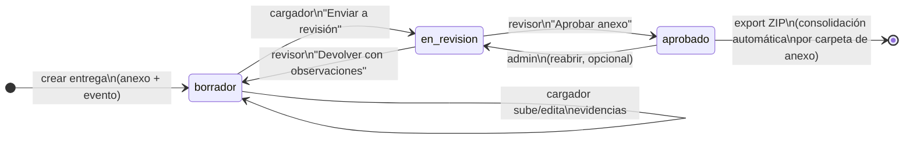

# Flujo de estados — entrega de anexo (borrador de diseño)

Especificación para la **tarea 5** del plan de desarrollo. El estado vive en la entidad **`delivery`** (una fila por `anexo + evento`), no en cada archivo suelto.

**Decisión de producto:** el **armado del entregable único** por anexo (copiar/organizar/merge de evidencias departamentales dentro de `02. …`) ocurre **dentro del job Export ZIP**, no como pantalla ni estado aparte.

---

## Diagrama de estados (entrega)

---

## Tabla de transiciones

| Desde | Hacia | Quién | Acción UI | Validaciones previas (MUST) |
| --- | --- | --- | --- | --- |
| — | `borrador` | Sistema / cargador | Abrir anexo por primera vez en un evento | Catálogo anexo + evento válidos |
| `borrador` | `borrador` | Cargador | Subir/editar evidencias | Región + depto + archivo + descripción (si sube archivo) |
| `borrador` | `en_revision` | Cargador | Enviar anexo a revisión | Requisitos mínimos del anexo; ≥1 evidencia cargada (definir con negocio); permiso depto |
| `en_revision` | `aprobado` | Revisor (misma región o admin) | Aprobar anexo (en detalle) | Observaciones vacías al aprobar |
| `en_revision` | `borrador` | Revisor | Devolver con observaciones | Texto de observación obligatorio |
| `aprobado` | — | Sistema (`export.package`) | Generar ZIP (pestaña Exportación) | Solo anexos `aprobado` (regla admin); armado de carpeta `NN.` en el worker |
| `aprobado` | `en_revision` | Admin | Reabrir (excepcional) | Motivo registrado en audit log |

---

## Estados — significado breve

| Estado | Significado |
| --- | --- |
| `borrador` | Se cargan evidencias departamentales; editable por cargador |
| `en_revision` | Cola del revisor |
| `aprobado` | Cumple revisión; **listo para incluirse en el ZIP** (el worker arma la carpeta del anexo) |

---

## Consolidación = paso interno del Export ZIP

Cuando el usuario pulsa **Generar ZIP**:

1. El worker recorre entregas en estado **`aprobado`**.
2. Por cada anexo, toma las evidencias aprobadas (región/depto) y **arma la carpeta** `NN. …` (copia archivos, subcarpetas por depto, o merge PDF — según reglas del tipo de anexo).
3. Escribe el ZIP + `manifest.json`.

No hay botón «Generar consolidado» en el detalle del anexo ni estado `consolidado` visible para el usuario.

---

## Relación con exportación nacional

- **Export ZIP (`01..70`):** solo entregas en **`aprobado`** (configurable en admin: incluir otros estados).
- La **consolidación** es lógica del processor `export.package`, no un paso manual previo.

---

## Pendiente de validar con negocio

- [ ] ¿Se puede enviar a revisión con 0 archivos?
- [ ] ¿Cargador puede seguir subiendo en `en_revision`?
- [ ] ¿`devuelto` es estado propio o se vuelve a `borrador`?
- [ ] Formato por familia de anexo dentro de cada carpeta (copia plana vs subcarpetas vs PDF único)
